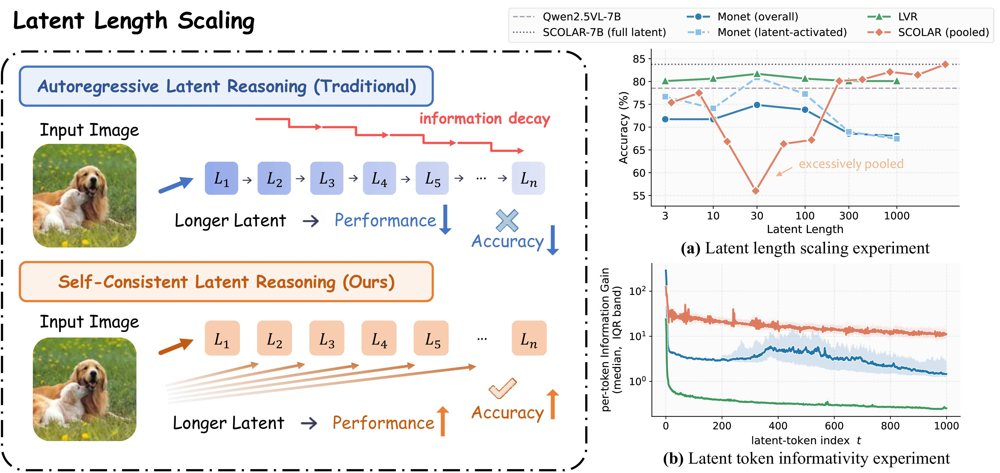
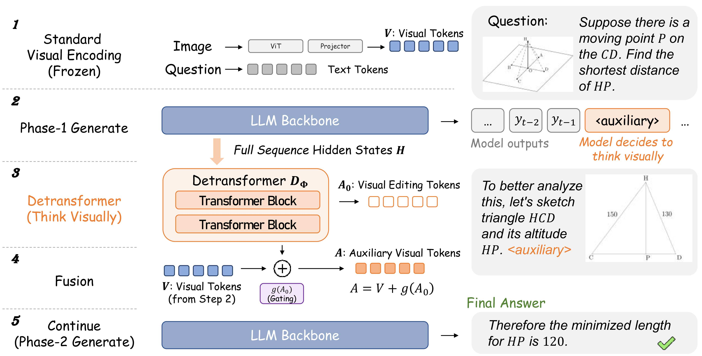
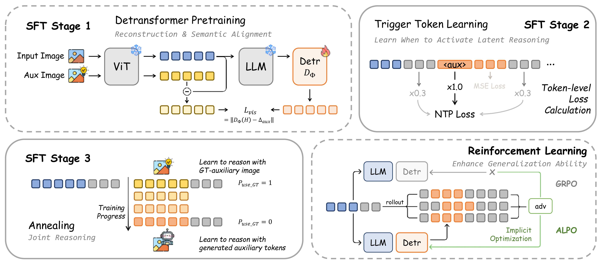
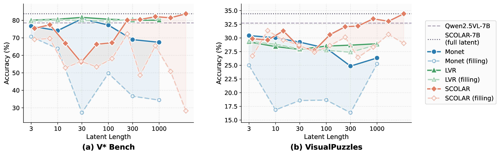
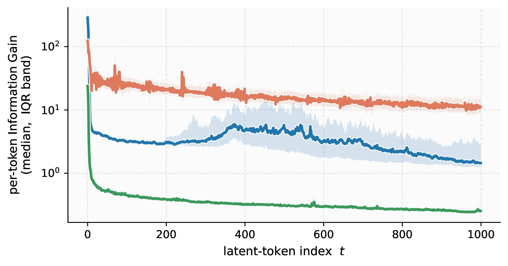

<div align="center">

# SCOLAR: Self-Consistent Latent Reasoning

### Long Latent Sequence Reasoning for Vision-Language Model

<p>
  <a href="https://arxiv.org/abs/2605.12163"></a>
  <a href="#"></a>
</p>

**Chenfeng Wang<sup>1,2</sup>, Wei He<sup>2</sup>, Xuhan Zhu<sup>2</sup>, Chunpeng Zhou<sup>2</sup>, Qizhen Li<sup>2</sup>, Song Yan<sup>1</sup>, Yufei Zheng<sup>1,2</sup>, Chengjun Yu<sup>1,2</sup>, Fan Lu<sup>1</sup>, Wei Zhai<sup>1,&dagger;</sup>, Yang Cao<sup>1</sup>, Pengfei Yu<sup>2,&dagger;</sup>, Zheng-Jun Zha<sup>1</sup>**

<sup>1</sup>University of Science and Technology of China &nbsp; <sup>2</sup>Li Auto Inc. 

<sup>&dagger;</sup>Corresponding authors

</div>

---

## Highlights

- We discover **Information Gain Collapse** --- the root cause of performance degradation in existing latent visual reasoning methods as latent sequences grow longer.
- We propose **SCOLAR**, a single-shot latent reasoning paradigm where a lightweight *detransformer* generates auxiliary visual tokens independently anchored to the original visual space, extending acceptable latent CoT length by **over 30x**.
- SCOLAR-7B achieves **state-of-the-art** among open-source models, surpassing **GPT-4o by 16%** on V\*Bench and **GPT-5.2 by ~10 points** on MME-RealWorld-Lite.

---

## Motivation

<div align="center">
  
</div>

> **Left:** Conventional autoregressive latent reasoning suffers from *information decay* --- each latent token depends on the preceding one, causing visual semantics to degrade along the chain. SCOLAR's auxiliary tokens independently anchor to the original visual space, fundamentally preventing this decay.
>
> **Right (a):** Latent length scaling experiments show SCOLAR continuously improves beyond a threshold, while Monet and LVR systematically degrade.
>
> **Right (b):** Information gain analysis confirms SCOLAR maintains high information gain (~10-30) across 1000 tokens, while LVR collapses after t=10.

---

## Method

<div align="center">
  
</div>

SCOLAR introduces a lightweight **detransformer** branch on the standard ViT-Projector-LLM architecture:

1. Encode the input image into visual tokens via ViT-Projector
2. LLM generates Phase-1 text until autonomously outputting the `<auxiliary>` trigger
3. Extract full-sequence hidden states and feed into the detransformer, generating auxiliary visual tokens **in a single shot**
4. Fuse auxiliary tokens with original visual features via gated residual addition
5. LLM continues Phase-2 generation in the augmented visual context

### Training Pipeline

<div align="center">
  
</div>

| Stage | Description |
|:-----:|:------------|
| **Stage 1** | Detransformer pretraining with delta-feature reconstruction |
| **Stage 2** | Trigger token learning via weighted next-token prediction |
| **Stage 3** | Joint reasoning with teacher-forcing annealing |
| **ALPO** | Auxiliary Latents Policy Optimization with outcome-driven rewards |

---

## Main Results

### Real-World Benchmarks

| Model | V\*Bench | HRBench4K | HRBench8K | MME-RealWorld-Lite |
|:------|:--------:|:---------:|:---------:|:-----------------:|
| GPT-4o | 67.50 | 59.00 | 55.50 | 52.00 |
| GPT-5.2 | 63.87 | 66.37 | 61.50 | 50.23 |
| Qwen2.5-VL-7B | 78.53 | 71.50 | 63.75 | 45.75 |
| DeepEyes | 83.25 | 71.25 | 65.13 | 54.28 |
| Monet | 83.25 | 71.00 | **68.00** | 55.50 |
| **SCOLAR-7B** | **83.77** | **75.50** | 67.63 | **59.87** |
| *Improvement vs backbone* | *+5.24* | *+4.00* | *+3.88* | *+14.12* |

### Out-of-Distribution Generalization (VisualPuzzles)

| Model | Overall | Deductive | Spatial |
|:------|:-------:|:---------:|:-------:|
| GPT-4o | 41.30 | 49.00 | 26.20 |
| Qwen2.5-VL-7B | 32.71 | 47.50 | 21.80 |
| **SCOLAR-7B** | **34.42** | **49.00** | **31.82** |

---

## Latent Length Scaling & Information Gain

<div align="center">
  
</div>

> **Latent Length Scaling & Meaningless Padding Experiments.** Solid lines: normal inference; dashed lines: latent tokens replaced with meaningless padding. SCOLAR shows *increasing* degradation when padding is applied at longer lengths --- confirming its tokens carry genuine, length-proportional visual semantics.

<div align="center">
  
</div>

> **Step-wise Information Gain.** SCOLAR maintains IG~10-30 across 1000 tokens (log scale), while LVR collapses after t=10 and Monet decays monotonically.

---

## Code Release

Our code and model weights will be released soon. Stay tuned!

---

## Citation

```bibtex
@misc{wang2026selfconsistentlatentreasoninglong,
      title={Self-Consistent Latent Reasoning: Long Latent Sequence Reasoning for Vision-Language Model}, 
      author={Chenfeng Wang and Wei He and Xuhan Zhu and Chunpeng Zhou and Qizhen Li and Song Yan and Yufei Zheng and Chengjun Yu and Fan Lu and Wei Zhai and Yang Cao and Pengfei Yu and Zheng-Jun Zha},
      year={2026},
      eprint={2605.12163},
      archivePrefix={arXiv},
      primaryClass={cs.CV},
      url={https://arxiv.org/abs/2605.12163}, 
}
```

---

<div align="center">
  <sub>University of Science and Technology of China &nbsp;&bull;&nbsp; Li Auto Inc.</sub>
</div>
